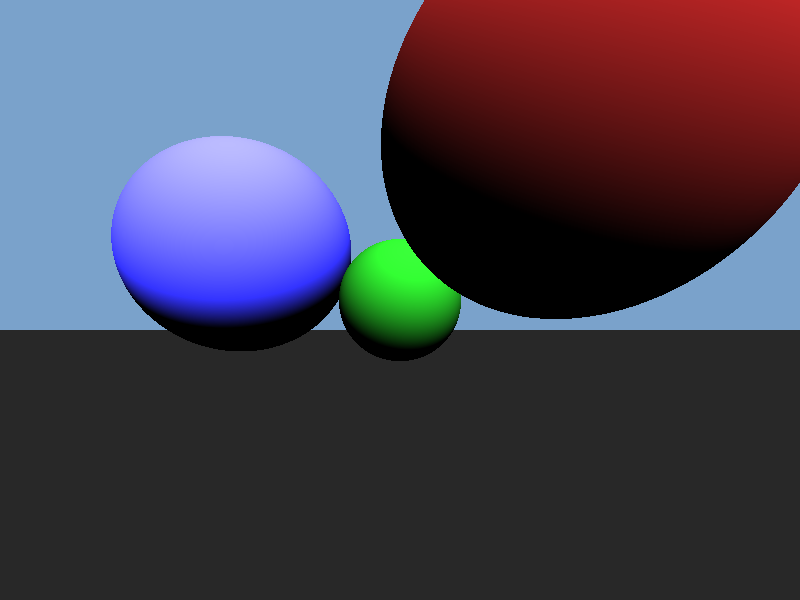

PHP-Raytracer
=============

Ray tracer written in PHP using the GD library. This was inspired by an [article](https://bheisler.github.io/post/writing-raytracer-in-rust-part-1/) I read about writing a Ray tracer in Rust. 

## Example image



## Requirements

* PHP 8.1
* GD extension
* Composer

## Usage

```shell
composer install
php main.php
```

